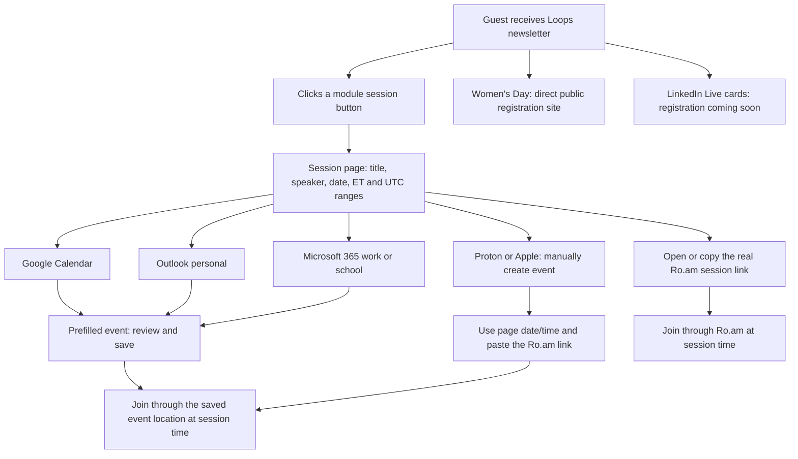

# Complete guest flow

## Newsletter entry

The email introduces the series, contains the kickoff card, Women's Day feature, upcoming session cards and social footer. TradFi is the first upcoming card, styled like the other module cards. Each of the seven module CTAs opens its corresponding calendar page. Women's Day links directly to `https://www.nationalweb3womensday.com/`.

Proof of Adoption and The Capital Table list their confirmed dates, 1:00–2:00 PM ET / 6:00–7:00 PM UTC, “Speakers to be announced” and “Registration coming soon”. No placeholder registration button is displayed.

## Page decisions

| Guest choice | What happens | Guest still needs to do |
|---|---|---|
| Open session link | Opens the supplied real Ro.am URL | Join when the session starts; any Ro.am permissions are managed by Ro.am |
| Copy | Copies the full Ro.am URL when the browser permits it | Paste it where needed |
| Google Calendar | Opens a prefilled Google event | Sign in if necessary, review date/time/link and Save |
| Outlook | Opens a prefilled personal Outlook event | Sign in if necessary, review and Save |
| Microsoft 365 | Opens a prefilled work/school Outlook event | Sign in if necessary, review and Save |
| Proton or Apple Calendar | Page supplies date, times and link for manual entry | Create the event and paste the session link in its location/notes |

The local-time label converts the same confirmed instant using browser time-zone settings and can display a different date for some zones. The page explicitly states that the label is based on the user's local time-zone settings. It does not ask for geolocation or an email address.

## No automatic invitation delivery

An earlier design proposed an inbox calendar invitation, requiring a verified sender and an email service. That design was not activated and was replaced by the current manual-entry instructions. There is no Mailgun setup, email-invite form, automatic Proton Accept flow or downloaded .ics file in this live version. Loops sends the newsletter separately when the owner chooses to send it.

## Entry URLs

- `/`: Token Fundamentals calendar page, not a full session index.
- `/newsletter/`: compiled newsletter browser preview.
- `/calendar/<session-id>/`: a specific module page; see the complete route list in [Session reference](SESSION_REFERENCE.md).
- `/assets/<filename>.png`: hosted artwork and logos.

The real Ro.am fragment (`#/d/...`) is part of the destination. Preserve it exactly in the data, copied link and provider location field.
